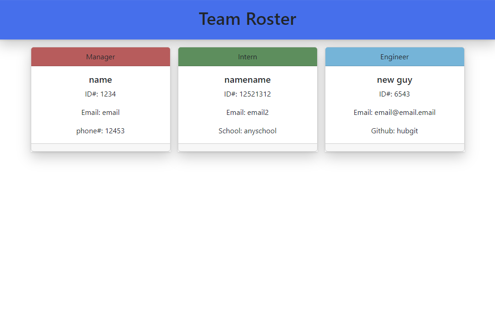

# Team Profile Generator

## License

  # 

  Begin license text.
    Copyright 2022  Bryan Schenck
    
    Permission is hereby granted, free of charge, to any person obtaining a copy of this software and associated documentation files (the "Software"), to deal in the Software without restriction, including without limitation the rights to use, copy, modify, merge, publish, distribute, sublicense, and/or sell copies of the Software, and to permit persons to whom the Software is furnished to do so, subject to the following conditions:
    
    The above copyright notice and this permission notice shall be included in all copies or substantial portions of the Software.
    
    THE SOFTWARE IS PROVIDED "AS IS", WITHOUT WARRANTY OF ANY KIND, EXPRESS OR IMPLIED, INCLUDING BUT NOT LIMITED TO THE WARRANTIES OF MERCHANTABILITY, FITNESS FOR A PARTICULAR PURPOSE AND NONINFRINGEMENT. IN NO EVENT SHALL THE AUTHORS OR COPYRIGHT HOLDERS BE LIABLE FOR ANY CLAIM, DAMAGES OR OTHER LIABILITY, WHETHER IN AN ACTION OF CONTRACT, TORT OR OTHERWISE, ARISING FROM, OUT OF OR IN CONNECTION WITH THE SOFTWARE OR THE USE OR OTHER DEALINGS IN THE SOFTWARE.
    
    End license text.

## Table of Contents

- [Description](#description)
- [Installation](#installation)
- [Testing](#testing)
- [Contact](#contact)

## Description

This is a program created to easy save basic employee data and append it to a set of HTML templates. It uses Inquirer to query the user and gather the data. It also has basic jest testing built out.

[Link to demonstration video](https://drive.google.com/file/d/18uE91NHYVcesD-j2jIcuMxEx10K2ynLl/view)

## Installation

Fork the repo, run an "npm install" and then "node index.js" to start the program. Easy as that.

## Testing

Type "npm run test" to start jest testing.

## Contact

Github: [brysgithub](https://github.com/brysgithub)